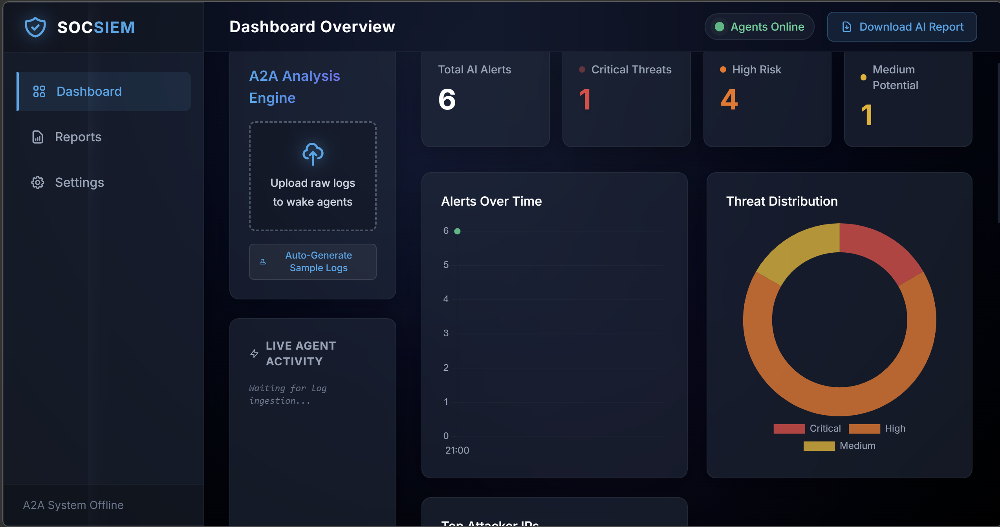
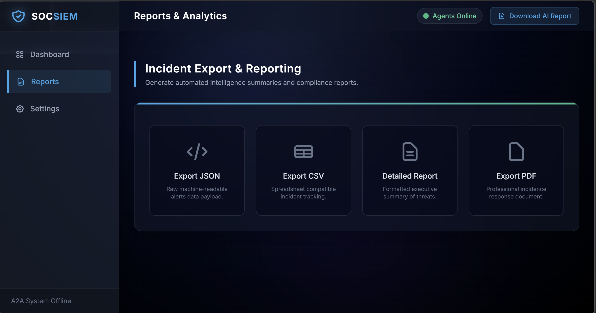
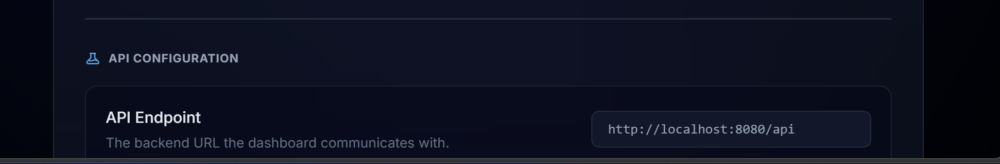
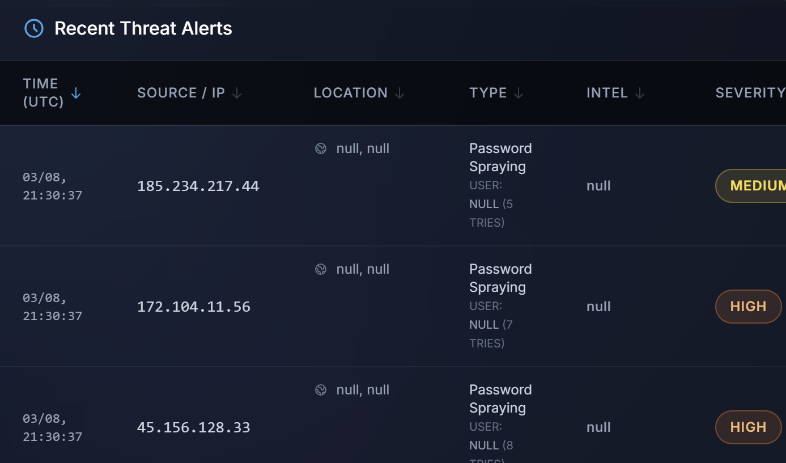

# SOCSIEM (SOCWatch) - Automated Security Operations Platform



SOCSIEM is a lightweight, high-performance Security Operations Center (SOC) monitoring platform and SIEM (Security Information and Event Management) tool. It provides real-time log ingestion, automated threat detection, and an interactive, modern dark-themed dashboard for security analysts.

## 🚀 Key Features

*   **Real-Time Log Monitoring:** Continuously tails authentication logs (`auth.log`) to immediately detect new login attempts, brute-force attacks, and anomalies.
*   **A2A Analysis Engine:** Agent-to-Agent architecture powered by AI for parsing logs, detecting threats, and orchestrating responses.
*   **Automated Threat Detection:** Identifies persistent threats and categorizes them by severity (Critical, High, Medium, Low) based on configurable failed attempt thresholds.
*   **Modern SOC Dashboard:** A fully responsive, professional dark-mode interface built with TailwindCSS and Vanilla JavaScript, featuring smooth transitions and real-time Chart.js visualizations.
*   **Incident Investigation:** Detailed timeline view and geolocation tracking for investigating specific attacker IP addresses.
*   **Comprehensive Export & Reporting:** Automatically generate and download structured intelligence summaries:
    *   **PDF:** Professional incident response documents formatted for executives.
    *   **JSON:** Raw machine-readable data payloads.
    *   **CSV:** Spreadsheet-compatible tracking.
    *   **TXT:** Detailed text summaries.

## 📸 Screenshots

### Reports & Analytics
Generate automated compliance reports and explore raw threat data payloads.


### System Configuration
Dynamically adjust A2A detection engine thresholds and core API endpoints without restarting the system.



## 🛠️ Technology Stack

**Backend:**
*   **Python 3.10+**
*   **FastAPI:** High-performance async API backend.
*   **SQLite:** Lightweight relational database for persistent alert storage.
*   **ReportLab:** For automated PDF incident report generation.

**Frontend:**
*   **HTML5 & Vanilla JavaScript:** No heavy frontend frameworks.
*   **TailwindCSS:** For utility-first, highly customizable SOC dark styling.
*   **Chart.js:** For rendering the "Alerts Over Time" and "Threat Distribution" data visually.

## ⚙️ Installation & Setup

### Prerequisites
*   Python 3.10 or higher installed.
*   `pip` package manager.

### 1. Clone the Repository
```bash
git clone https://github.com/Drupadh/SOCWatch.git
cd SOCWatch
```

### 2. Set up the Backend
Create a virtual environment and install the required Python dependencies:

```bash
# Create virtual environment
python -m venv venv

# Activate the virtual environment
# On Windows:
venv\Scripts\activate
# On macOS/Linux:
source venv/bin/activate

# Install dependencies
pip install -r requirements.txt
```
*(If a `requirements.txt` is not present, install core packages: `pip install fastapi uvicorn sqlite3 reportlab aiofiles pydantic`)*

### 3. Start the Server
Run the FastAPI backend using Uvicorn:

```bash
uvicorn backend.main:app --reload --port 8080
```
The API will be available at `http://localhost:8080/api`.

### 4. Access the Dashboard
Open the `frontend/index.html` file in any modern web browser to access the SOCSIEM dashboard. Ensure the API Endpoint in the **Settings** tab is pointing to your locally running backend (e.g., `http://localhost:8080/api`).

## 📁 Project Structure

```text
SOCWatch/
├── backend/
│   ├── main.py              # FastAPI application entry point
│   ├── detection_engine.py  # Threat analysis and categorization logic
│   ├── database.py          # SQLite database connection and operations
│   ├── log_monitor.py       # Asynchronous log tailing service
│   ├── reporting/           # Modules for generating PDF/CSV/JSON exports
│   └── agents/              # A2A orchestration and parsing agents
├── frontend/
│   ├── index.html           # Main dashboard interface
│   ├── css/style.css        # Custom component styling and animations
│   └── js/app.js            # Frontend logic, API calls, and chart rendering
├── logs/                    # Directory for raw monitored log files (auth.log)
├── reports/                 # Auto-generated incident export directory
└── assets/                  # Images and screenshots for documentation
```

## 🔒 Configuration

You can manage system configurations directly from the **Settings** view in the UI:
1.  **Critical Severity:** Triggers after massive repeated failed attempts (e.g., >10).
2.  **High Severity:** Triggers for sustained brute-force activities.
3.  **Medium Severity:** Triggers on early signs of credential stuffing.
4.  **API Endpoint:** Allows switching between local development backends and production servers.
